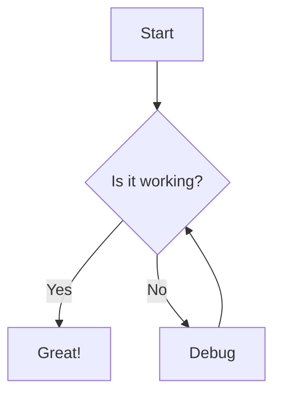
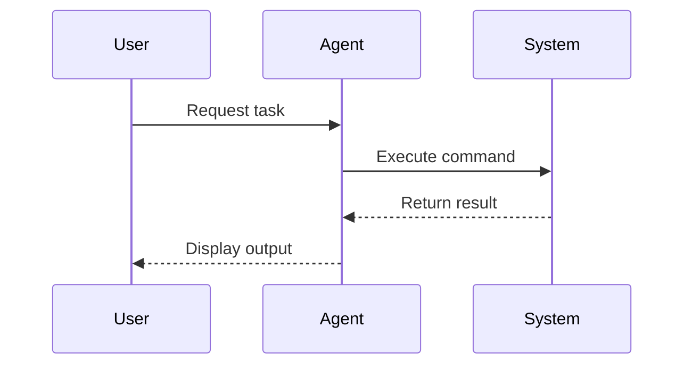

This is a test for obsidian note taking

# Checkbox

- [ ] Todo
- [x] Done
- [-] Delay

# Callouts

> [!note] Note
> This is a note callout

> [!warning] Warning
> This is a warning callout

> [!tip] Tip
> This is a tip callout

> [!info] Info
> This is an info callout

> [!danger] Danger
> This is a danger callout

# LaTeX

Inline math: $E = mc^2$

Block math:

$$
\int_{-\infty}^{\infty} e^{-x^2} dx = \sqrt{\pi}
$$

# Mermaid



# Mermaid Sequence Diagram



# Code Blocks

```python
def hello():
    print("Hello, Obsidian!")
```

```javascript
const greeting = "Hello, Obsidian!";
console.log(greeting);
```

# Tables

| Column 1 | Column 2 | Column 3 |
| -------- | -------- | -------- |
| Row 1    | Data     | More     |
| Row 2    | Data     | More     |

# Links

Internal link: [[Examples]]
External link: [Obsidian](https://obsidian.md)

# Embeds

![[Examples#Checkbox]]

# Tags

#tag1 #tag2 #obsidian-example

# Footnotes

Here is a footnote reference[^1].

[^1]: This is the footnote text.

# Formatting

**Bold text**
_Italic text_
==Highlighted text==
~~Strikethrough~~
`Inline code`
