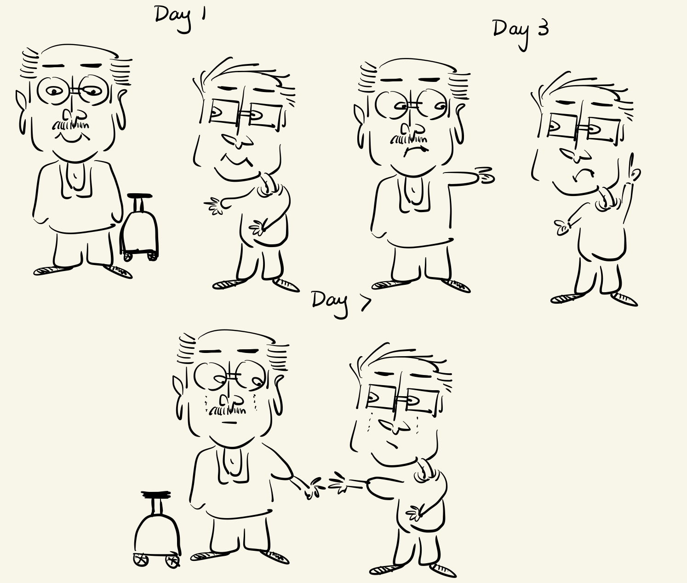
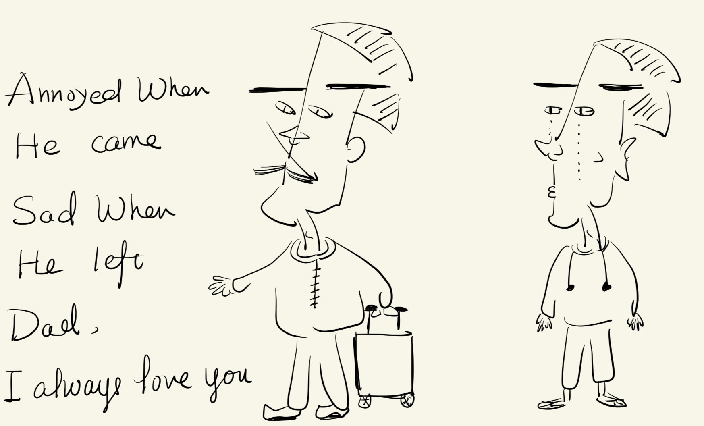
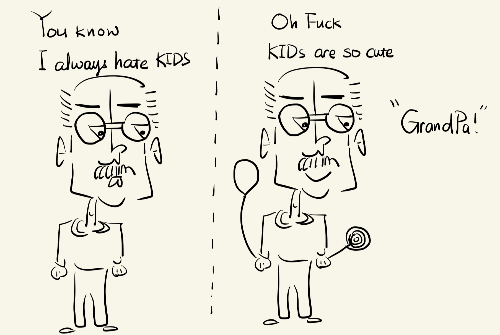

# Collection1

  <figure markdown="span">
  { width=300, height=200 loading=lazy }
    <figcaption>My Avatar</figcaption>
  </figure>

  <figure markdown="span">
  { width=300, height=200 loading=lazy }
    <figcaption>Father and Son</figcaption>
  </figure>

  <figure markdown="span">
  { width=300, height=200 loading=lazy }
    <figcaption>Depature</figcaption>
  </figure>

  <figure markdown="span">
  { width=300, height=200 loading=lazy}
    <figcaption>Kids or Not?</figcaption>
  </figure>

  <figure markdown="span">
  { width=300, height=200 loading=lazy}
    <figcaption>Void or Not?</figcaption>
  </figure>

