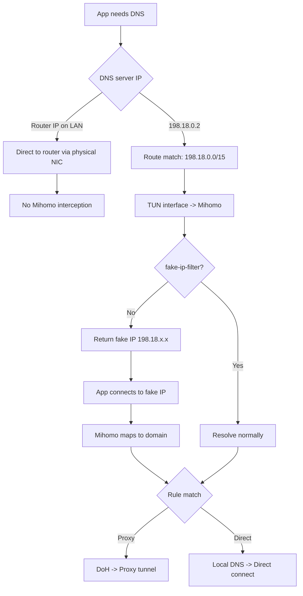

# Mihomo Notes

## Mihomo Proxy in TUN Mode

```yaml
dns:
  enable: true
  ipv6: true #如网络环境不支持IPv6请设为false
  enhanced-mode: fake-ip
  fake-ip-range: 198.18.0.1/16
  fake-ip-filter: #使用geosite域名集合以精简配置，也可使用规则集（ruleset）
    - geosite:private
    - geosite:category-ntp
  use-hosts: false #如有特殊需求请设为true
  use-system-hosts: false #如有特殊需求请设为true
  nameserver:
    - https://1.1.1.1/dns-query
    - https://8.8.8.8/dns-query
  proxy-server-nameserver:
    - https://223.5.5.5/dns-query
    - https://223.6.6.6/dns-query
  direct-nameserver:
    - https://223.5.5.5/dns-query
    - https://223.6.6.6/dns-query
  respect-rules: true
```

### DNS YAML Explain

- **`enhanced-mode: fake-ip`**: This is the core of the setup. Mihomo returns a reserved IP (from the `fake-ip-range`) immediately to the app, bypassing the wait for a real DNS resolution.
- **`fake-ip-filter`**: A "whitelist" of domains that should **not** receive a fake IP. These are resolved normally to prevent issues with local services, NTP (time syncing), or private intranet addresses.
- **`nameserver`**: These are the "Remote DNS" servers used for domains that match proxy rules. Using HTTPS (DoH) ensures your ISP cannot see or hijack your DNS queries.
- **`proxy-server-nameserver`**: Used specifically to resolve the IP addresses of your **proxy nodes** themselves.
- **`direct-nameserver`**: Used for domains that match "Direct" rules. Using local high-quality providers (like Alibaba 223.5.5.5) ensures the lowest latency for domestic sites.

### TUN (Terminal User Network)

TUN mode creates a **Virtual Network Interface** at the OS level.

- **How it works**: It acts like a virtual network card. Instead of just intercepting browser traffic (like a system proxy), it captures **all** traffic from the entire operating system.
- **The Benefit**: Apps that don't support proxy settings (like Terminal, Spotify, or games) are automatically routed through Mihomo because the OS treats the TUN interface as the gateway to the internet.

### How macOS Routes the DNS Request

This section separates the **normal DNS path** from the **Mihomo TUN interception path**, and explains why `198.18.0.2` is chosen.

---

#### 1. Normal Situation: DNS = Home Router (No Hijack)

In a typical LAN, the DNS server is your **router IP** (for example, `192.168.1.1`) or an ISP DNS reachable through it.

- macOS sees `192.168.1.1` as **on-link** (same subnet), so it sends the DNS packet directly to the router via the physical NIC.
- This is the OS doing the **fastest local delivery**: no extra routing lookup, no tunneling, no detour.
- Because the destination is local, **Mihomo cannot intercept it in TUN mode** unless you explicitly route that local subnet into the TUN interface. By default, it stays on the physical interface.

In short: if DNS is your router, macOS optimizes for local delivery and the packet never reaches Mihomo.

---

#### 2. TUN Interception: DNS = `198.18.0.2`

To force DNS into Mihomo, you set DNS to a **fake IP** inside the RFC 2544 range:

- The destination `198.18.0.2` is **not on your LAN**, so macOS consults the routing table.
- Mihomo installs a **more specific route** for `198.18.0.0/15` via the TUN interface.
- The kernel picks the most specific route and sends DNS traffic into Mihomo, which can then return fake IPs and apply rules.

---

#### 3. Why `198.18.0.2` (and Not `223.5.5.5`, or `8.8.8.8`)

- **`198.18.0.0/15` (RFC 2544)** is reserved for benchmarking and **not routable on the public internet**. It is safe for “fake” destinations.
- **Avoids collisions with real DNS**: `8.8.8.8` (Google) and `223.5.5.5` (Alibaba) are real, reachable resolvers. If you point DNS at them, macOS will try to reach them directly, and Mihomo cannot reliably intercept without forcing their routes into TUN.
- **Safe failure mode**: If Mihomo crashes, packets to `198.18.x.x` will hit your router, and the router will drop them because those IPs are not valid on the public internet.

## Mermaid Process Graph (Optimized)


